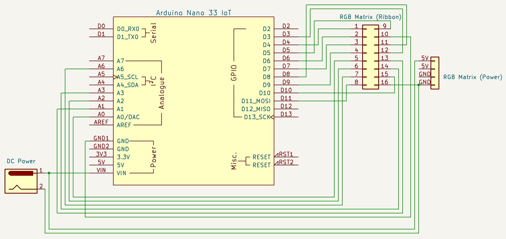
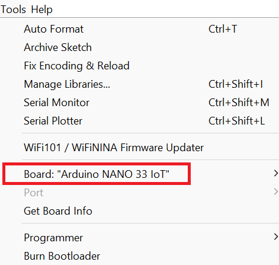
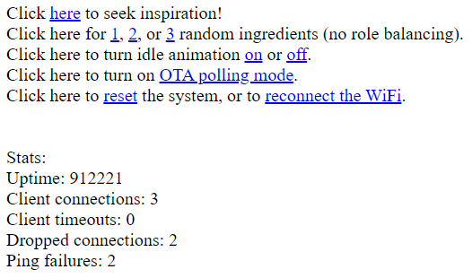
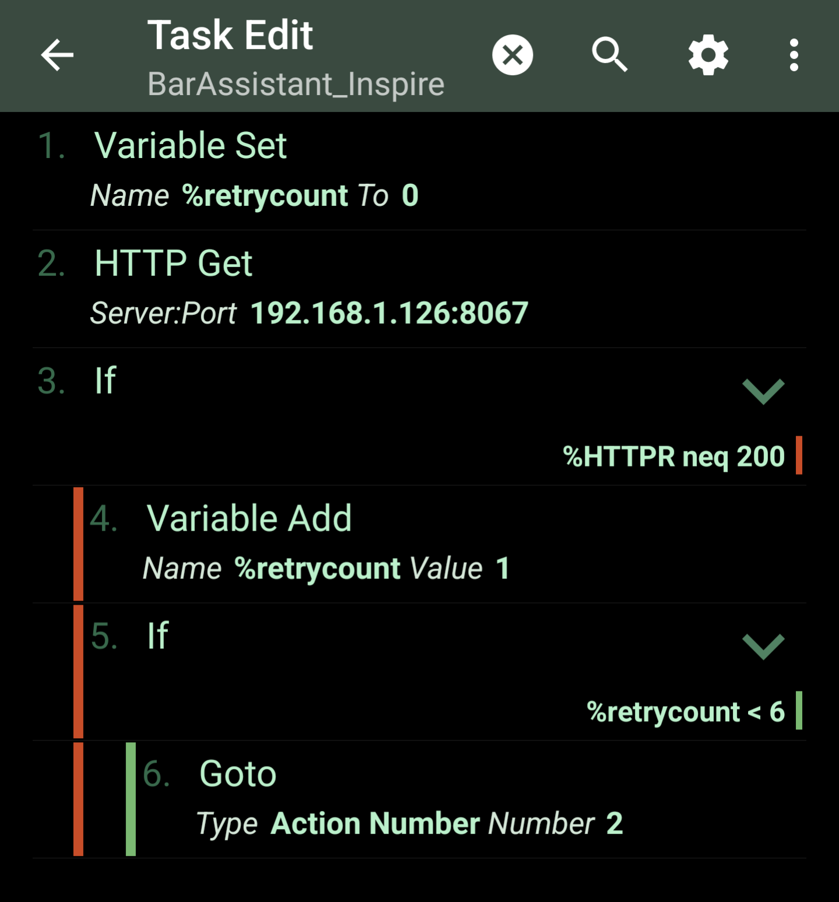

# BarAssistant

Welcome to the LED Bar Assistant! A quick, low-cost, Arduino based project, this LED matrix assistant generates mixological suggestions from your home bar! You can trigger suggestions through your web browser, or through integration with a smart home device. It's WiFi-enabled and customizable, so you can easily update it with your own ingredients and experiment with new tasks.

The assistant consists of:
* An LED Matrix, to display results
* A wifi-enabled microcontroller/microcomputer, to drive the display and host a webserver
* A breadboard, to connect the above components, and, optionally
* A smart device that can trigger suggestions

This tutorial will cover which components to purchase, how to wire up the device, how to program the Arduino, and how to use/customize the Assistant for your home!

# What You'll Need

The code here is written for these specific devices, but you could likely adapt it for different displays/MCUs with slight modifications.

* [64x32 RGB LED Matrix](https://www.adafruit.com/product/2277)
* [Arduino Nano 33 IoT](https://store-usa.arduino.cc/products/arduino-nano-33-iot)
* [5V DC power adapter](https://www.adafruit.com/product/1466)
* [Barrel jack adapter](https://www.adafruit.com/product/368)
* Solderless breadboard
* Male-male jumper cables

# Wiring

For the Nano 33 IoT, the schematic below shows how to wire the LED Matrix to the Arduino and to power. A similar mapping may work for other microcontrollers, but will depend on the underlying clock ports on which each pin resides. Adafruit has [some instructions](https://learn.adafruit.com/32x16-32x32-rgb-led-matrix/connecting-with-jumper-wires) for wiring other popular Arduino boards. 

# Software

If you haven't already, download the [Arduino IDE](https://www.arduino.cc/en/software). I recommend the 1.8.X legacy versions, as the 2.X versions currently do not support the OTA programming feature that makes it easier to update your Assistant over time. You'll then need to install the following libraries:

[RGB-matrix-Panel](https://github.com/estrasnick/RGB-matrix-Panel) -- A version of the original [Adafruit RGB Matrix Panel library](https://github.com/adafruit/RGB-matrix-Panel), forked to include support for the Nano 33 IoT board used here. The official version will work pending a [pull request](https://github.com/adafruit/RGB-matrix-Panel/pull/59).

[WiFiNINA](https://www.arduino.cc/reference/en/libraries/wifinina/) -- An official library used to control WiFi capabilities on the Nano 33 IoT and similar boards.

[ArduinoOTA](https://www.arduino.cc/reference/en/libraries/arduinoota/) -- An official library used to enable over-the-air updating of the board's programming.

[Adafruit_SleepyDog_Library](https://www.arduino.cc/reference/en/libraries/adafruit-sleepydog-library/) -- We use this to trigger the watchdog timer, which is one reliable way to reset the Arduino to its initial state via software control.

### Configuring the assistant

With those libraries installed, open this repository as an Arduino project.

First, you'll need to enter your WiFi credentials, so that the board can connect. Set the fields in `arduino_secrets.h`: `SECRET_SSID` is your network name, and `SECRET_PASS` is the password. `OTA_PASS` is a password to provide when attempting to reprogram the board using over-the-air programming (see below).

Then, set the various parameters within `BarAssistant.ino` per your preferences:
* `PANEL_WIDTH` and `PANEL_HEIGHT` for the dimensions of your display (64 and 32 if using the display above).
* `DISPLAY_DURATION_MS` is the timeout (in milliseconds) of a displayed result.
* `HUE_INCREMENT`, when set above zero, will cause the text to cycle through colors as they display. Higher numbers yield faster cycling.
* `CONNECTION_CHECK_INTERVAL_MS` and `PING_CHECK_INTERVAL_MS` attempt to detect whether the board has an active WiFi connection. It will attempt a reconnect if these checks fail. You can set the IP to ping using `PING_HOSTNAME`, or disable it entirely with `ENABLE_PING_CHECK`.
* If `ENABLE_PERIODIC_RECONNECT` is set, the board will periodically attempt to reset its connection, as some routers have a TCP keepalive timeout.
* `WEBSERVER_PORT` defines the port that your client (browser, smart device, etc.) will use when connecting.
* `ip` defines the IP address of the Assistant on your local network.

Finally, it's time to enter your ingredients! As purely random combinations of your ingredients are likely to yield some awful creations, the Assistant can be configured to have an understanding of ingredient "roles". Those roles are: *base* (spirits, etc.), *modifiers* (liqueuers, etc.), and *seasonings* (bitters, etc.). When triggering a suggestion, the Assistant can draw at random from each of these roles. Roles break down further into types -- for example, a modifier might be a juice, liqueur, or carbonation.

You'll enter ingredients in the `ingredients` data structure. For each ingredient, add its name, role, type, and whether you currently have the item in stock. Only items marked as in-stock will be used in suggestions.

Finally, the Assistant can play an idle animation when not displaying suggestions. By default, this animation is set to the plasma animation included in the Adafruit RGB Matrix Panel library. While the Assistant is running, you can turn this animation on or off (such that the display is inactive when not displaying results), and you can set whether the animation is enabled by default upon boot with the `DEFAULT_IDLE_ON` parameter.

### Programming the board

You'll need to perform the initial install via a wired (USB) connection. Set your board configuration to use the Nano 33 IoT, install any necessary board definitions if prompted, and then program the board:

To make sure your Assistant actually ends up at the WiFi network you've specified, you'll probably want to find the Arduino in your router's configuration page, and [assign it a static IP](https://www.howtogeek.com/184310/ask-htg-should-i-be-setting-static-ip-addresses-on-my-router/).

If all goes well, you should be able to reach the Assistant by visiting the IP address you configured! (Example 1 below.)

# Usage

### Example 1: Browser

You can view the homepage of your Assistant via a web browser by visiting <ip_address>:\<port>. *Your browser's device must be connected to the same local network as the Assistant.* For example, with the default parameters, you would visit 192.168.1.126:8067.

The default page provides several options:
* "seek inspiration" will provide you with a random, role-balanced three-ingredient suggestion for a drink
* Below, you'll find options to pull random ingredients with no role-balancing
* The idle animation can be manually turned on and off with the corresponding links
* Below that, you'll find an option to set the Arduino into OTA update mode (for use when updating the ingredients list)
* Finally, there are software triggers to reset the device or force a WiFi reconnect

The default home page is pretty bare-bones -- feel free to add style tags to the returned HTML in `BarAssistant.ino` to give it your own flair!

### Example 2: Smart device

By default, the Assistant connects only to a local network. Your router can be configured to forward its address to the wide-area network, but there are security risks in allowing incoming traffic to devices on your local network. An alternative, described here using an Android phone and the Tasker app, is to use a device on your local network to forward commands to the Assistant.

[Tasker](https://tasker.joaoapps.com/) is an automation tool for Android phones. Here, we use it to send a web request to the Assistant. Configure a new task as shown below, with a GET request an a bit of retry logic:

Within the GET request, set the PATH to the corresponding suggestion, e.g. `random_rolebalance` for the default 3-ingredient suggestion. You can also set this path so as to turn on/off the idle animation, etc.

The tasker task can be triggered by any profile. One handy one is to use AutoApps to respond to queries from a smart device, like Google Home. [This AutoApps tutorial](https://joaoapps.com/autovoice/) shows how to configure tasker to respond to a voice command. For example, you can trigger the task to fire when asking, "What should I drink?"

# Reprogramming the board

To update the BarAssistant (e.g. when adding new items to your bar), you can reconnect your PC to the Arduino, edit the sketch, and reprogram the board.

Alternatively, to reprogram the board without re-connecting the Arduino, you can make the changes in the Arduino IDE, then program over-the-air. Click the link to turn on OTA polling mode (which should cause your Assistant to freeze), and then use the OTA programming option in the IDE to reprogram the board. For detailed instructions on using the OTA programming feature, see the [ArduinoOTA library documentation](https://github.com/jandrassy/ArduinoOTA).

# Troubleshooting

* Make sure you are attempting to connect the Arduino to a 2.4 GHz network. The Nano 33 IoT used in this example does not support 5 GHz networks.
* If the Assistant loses connectivity or otherwise becomes unresponsive, manually power cycling the Arduino should return it to a reachable state.
